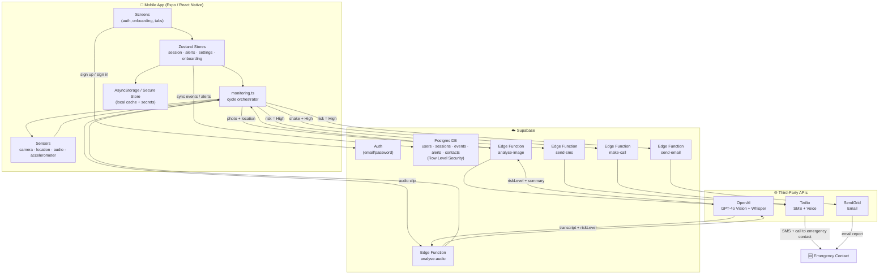

# Surveillance AI — Final Year Project Defense Deck

Speaker notes are in _italics_ under each slide's bullets. Aim for ~1 minute
per slide (15 slides ≈ 15 minutes, leaving room for Q&A).

---

## Slide 1 — Title

**Surveillance AI**
_AI-Powered Passive Personal Safety Monitoring_

- Your Name
- Final Year Project — [Course / Institution]
- Supervisor: [Name]

---

## Slide 2 — The Problem

- Personal safety apps today rely on the user **actively pressing a button**
  during a crisis
- In a real emergency, victims are often unable to act — panicked,
  restrained, or incapacitated
- Existing solutions (panic buttons, manual check-ins) fail exactly when
  they're needed most

_Open with a real scenario: someone walking home alone, or on a first date
with a stranger. Ask: "What if the app could notice danger before you even
reach for your phone?"_

---

## Slide 3 — The Gap in Existing Solutions

| App type                             | Limitation                                           |
| ------------------------------------ | ---------------------------------------------------- |
| Panic-button apps (Noonlight, bSafe) | Requires manual trigger                              |
| Geofencing / location-share apps     | No understanding of _what's happening_, only _where_ |
| Wearable fall-detection              | Single-signal, no visual/audio context               |

- None of these combine **vision + audio + motion** into one AI-driven
  risk assessment that fires automatically

---

## Slide 4 — Solution Overview

> "Surveillance AI silently monitors your surroundings using your phone's
> sensors and immediately alerts your emergency contact by SMS, email, and
> call if danger is detected."

Core features:

- One-tap start/stop surveillance session
- Passive camera snapshots + ambient audio + GPS + accelerometer
- AI risk scoring every cycle (Low / Medium / High)
- Automatic SMS + email + phone call on High risk
- Shake/impact detection bypasses AI for instant alert
- Wellness check-in with missed-check-in auto-alert

---

## Slide 5 — Tech Stack

- **Frontend:** Expo, React Native, TypeScript, Expo Router, NativeWind
- **State:** Zustand + AsyncStorage persistence
- **Backend:** Supabase (Postgres + Auth + Row Level Security + Edge
  Functions)
- **AI:** OpenAI GPT-4o (vision + risk reasoning), Whisper (audio
  transcription)
- **Alerts:** Twilio (SMS + Voice), SendGrid (Email)
- **Native sensors:** expo-camera, expo-audio, expo-location,
  expo-sensors, expo-task-manager

_Be ready to justify each choice — see "why X instead of Y" prep notes._

---

## Slide 6 — System Architecture

_(See one-page diagram — next section of this document / present as a
full-slide image)_

- Client never talks to OpenAI/Twilio/SendGrid directly
- All third-party API calls proxied through Supabase Edge Functions so
  API keys never ship inside the app bundle
- Client talks to Supabase directly only for Auth and RLS-protected data

---

## Slide 7 — Onboarding Flow

- 12-screen guided flow, run once on first launch
- Collects: who you're protecting, when you need protection, emergency
  contact, monitoring interval, shake sensitivity
- Requests 4 permissions one at a time with plain-language explanations:
  Camera → Microphone → Location (Always) → Notifications
- Ends with a personalised "plan reveal" screen

_Emphasize the UX reasoning: permission requests are proven to have higher
acceptance rates when explained individually, in context._

---

## Slide 8 — The Monitoring Loop (Core Engine)

1. Session starts → cycle repeats every 20–30s (configurable)
2. Camera snapshot + GPS captured **in parallel**
3. Event logged **immediately** with a placeholder — no waiting on AI
4. Audio recorded concurrently, transcribed via Whisper
5. Photo sent to GPT-4o Vision for risk analysis
6. Both AI results combine into one risk score (`combineRisks` — takes
   the higher of the two)
7. Accelerometer shake detection runs **independently and continuously**
   — bypasses the AI cycle entirely for instant response

_This slide is your architecture "money slide" — know src/lib/monitoring.ts
well enough to explain it without notes._

---

## Slide 9 — AI Risk Scoring

- GPT-4o Vision + Whisper, prompted to return structured JSON:
  `{ riskLevel, summary, concerns, confidence }`
- Prompts explicitly instruct the model to **be conservative** — only
  rate High with clear evidence of danger
- Medium risk → notifies the _user_ only (human-in-the-loop buffer)
- High risk → alerts the emergency contact automatically
- Shake events skip AI entirely — the most reliable signal gets the
  fastest path

---

## Slide 10 — Alert Pipeline

- Three channels fire together on High risk: **SMS, Email, Phone Call**
- Phone call reserved for highest-confidence events only (shake + AI
  High combined, not AI High alone)
- All requests routed through Supabase Edge Functions (Twilio, SendGrid)
- Deduplication: an alert only fires once per event ID, preventing
  repeat alerts for the same detected incident
- Every alert stores a full record locally and syncs to Supabase

---

## Slide 11 — Security & Privacy

- Row Level Security enabled on every Supabase table — `auth.uid()`
  scoping means users can only ever access their own data
- API keys (OpenAI, Twilio, SendGrid) live only in Edge Functions —
  never in the client bundle
- Emergency contact details and session data stored via Expo Secure
  Store / RLS-protected tables
- Event log auto-clears after 5 days — privacy-by-design retention limit
- Open discussion point: recording bystanders raises consent questions
  under one-party vs two-party consent laws — a real-world constraint
  worth acknowledging, not solving here

---

## Slide 12 — Testing & Validation

- Manual, scenario-based testing on physical devices (simulators can't
  test camera, mic, background execution, or push notifications)
- Checklist covers: auth flows, onboarding, permission-denied degraded
  mode, session lifecycle, background execution, shake detection, alert
  firing
- AI accuracy was evaluated qualitatively against staged scenarios, not
  a formal labeled dataset (explicitly named as a limitation)

---

## Slide 13 — Limitations & Future Work

- No automated test suite / no formal precision-recall evaluation of AI
  risk scoring
- Battery and data usage under continuous monitoring not yet profiled
- No offline fallback if network or AI provider is unreachable
  mid-emergency
- Single emergency contact only — no escalation chain
- Consent/legal questions around recording bystanders unresolved
- Future: on-device fallback model for offline risk scoring, multiple
  contacts with escalation tiers, wearable integration

---

## Slide 14 — Live Demo

- Start a surveillance session → show event appearing in the Log tab
- Trigger a simulated shake event → show instant High-risk alert path
- Show Settings: emergency contact, monitoring interval, shake
  sensitivity
- _Have a backup screen recording ready in case live demo fails_

---

## Slide 15 — Conclusion & Q&A

- Recap the one-liner and the core engineering contribution: combining
  multimodal AI signals into one automatic, passive alert pipeline
- Thank the panel, open the floor

---

# One-Page Architecture Diagram

**Key design principle shown in the diagram:** the client never talks to
OpenAI, Twilio, or SendGrid directly — every third-party call is proxied
through a Supabase Edge Function, so no API key ever ships inside the app
bundle.
